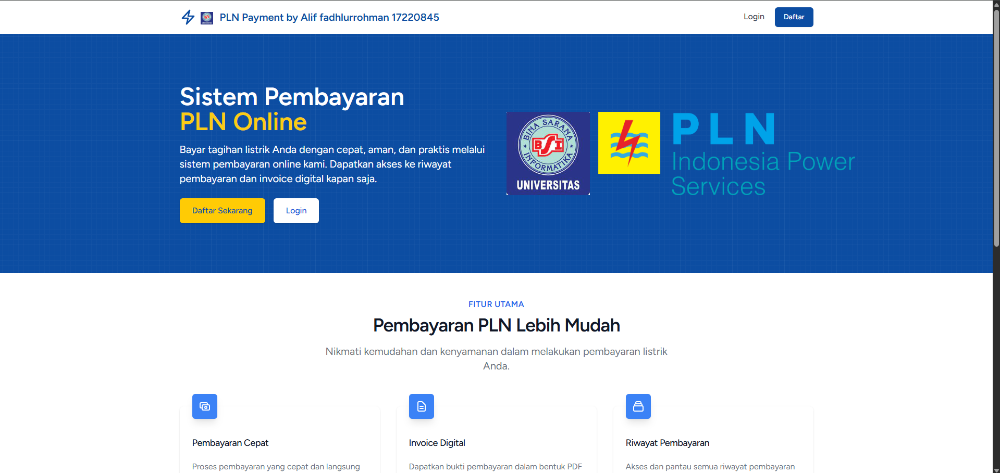
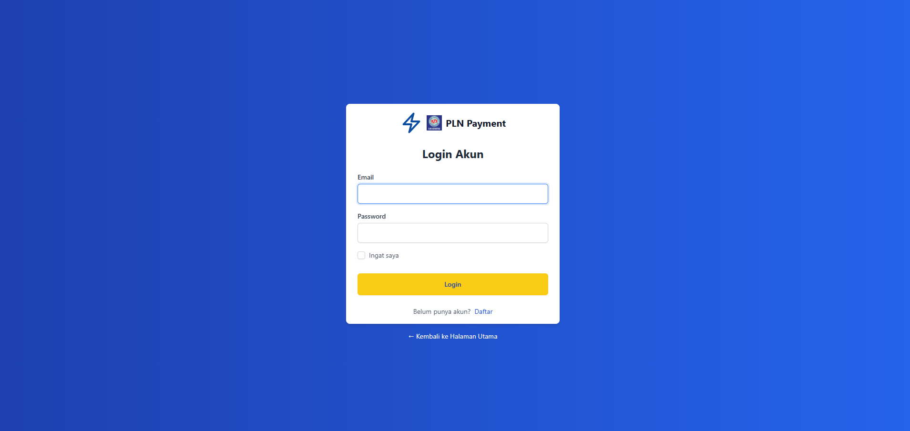
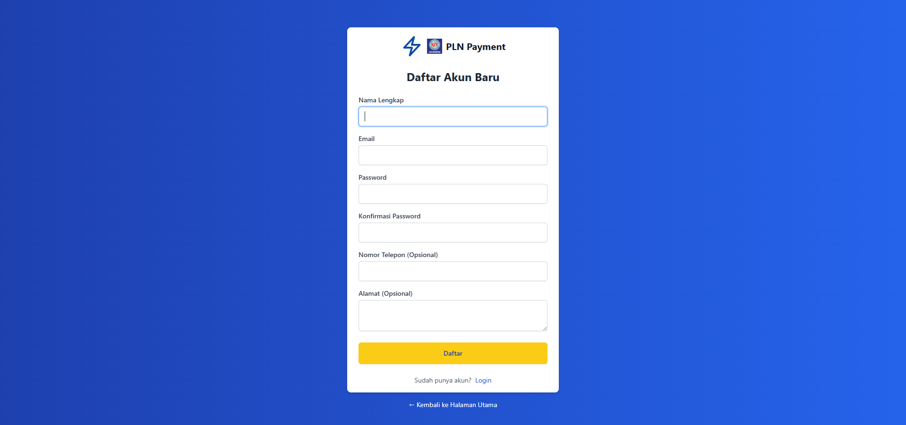

# ⚡ Payment PLN - Laravel Web Application


> A Laravel-based web application for managing electricity bill payments, equipped with user authentication, role-based access control, payment history, and PDF receipt generation.

---

## 📸 Screenshots

- Home Page 

- Login Page

- Registrasi Page

-Home Page (admin)
.png)
-History Page (admin)
.png)
-Edit Account

-PDF file report

---

## 🔥 Features

- ✅ User Authentication (Login & Registration)
- 👥 Role-based Access (Admin & Customer)
- 💳 Electricity Bill Payment System
- 🧾 Transaction History with PDF Export
- 👤 User Management (Admin only)
- 📄 Responsive UI using Blade and Bootstrap

---

## ⚙️ Built With

- **Backend**: Laravel 10 (PHP Framework)
- **Frontend**: Blade Templates + Bootstrap 5
- **Database**: MySQL / MariaDB
- **PDF Generation**: DOMPDF
- **Others**: Composer, NPM, Laravel Artisan

---

## 🚀 Getting Started

### 🖥️ Requirements

- PHP >= 8.1
- Composer
- Node.js & NPM
- MySQL / MariaDB
- Git

### 📦 Installation Steps

```bash
# 1. Clone the repository
git clone https://github.com/Aliffer07/Payment_PLN.git
cd Payment_PLN

# 2. Open in VSCode (optional)
code .

# 3. Install PHP & JS dependencies
composer install
npm install && npm run dev

# 4. Copy the .env file and generate key
cp .env.example .env
php artisan key:generate

# 5. Configure your database in the .env file
DB_DATABASE=your_database_name
DB_USERNAME=root
DB_PASSWORD=

# 6. Run the migrations
php artisan migrate

# 7. Start the Laravel development server
php artisan serve
```

## 🧭 User Roles & Access
Role	Description	Accessible Menus
Admin	System Administrator	Home, Payments, History, User Management
Customer	Registered bill payer	Home, Payments, History

## 🗂️ Project Structure (Simplified)
pgsql
Copy
Edit
├── app/             → Business logic (Controllers, Models)
├── resources/views/ → Blade templates for frontend
├── routes/web.php   → Web routes
├── public/          → Public assets (CSS, JS, Images)
├── database/        → Migrations & seeders
├── .env             → Environment configuration

## 🛡️ License
This project is licensed under the MIT License.

## 🤝 Contributing
Contributions are welcome!
Feel free to fork the repository, create a new branch, and submit a pull request.

## 📬 Contact
Alif Fadhlurrohman
GitHub: @Aliffer07
Email: aliffadhlurrohman20@gmail.com

